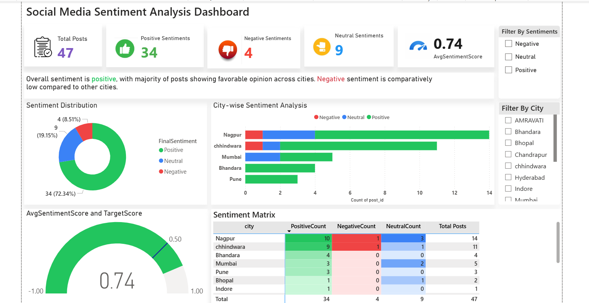

# Sentiment Analysis Dashboard 

# Project Overview

This project analyzes public sentiment posts using SQL Server and Power BI. Posts are classified as Positive, Negative, or Neutral based on sentiment keywords, and the results are visualized in an interactive dashboard.

# Dashboard Preview

## Tools Used

- SQL Server
- Power BI

# Dashboard KPIs

- Total Posts
- Positive Posts
- Negative Posts
- Neutral Posts
- Average Sentiment Score

# Dashboard Features

- Sentiment Distribution
- City-wise Analysis
- Sentiment Score Gauge
- Sentiment Matrix
- Interactive Filters ( Sentiment, City)

# SQL Work

- Table creation queries
- SQL Views
  

## Repository Structure

- Dashboard
- Dataset
- SQL
